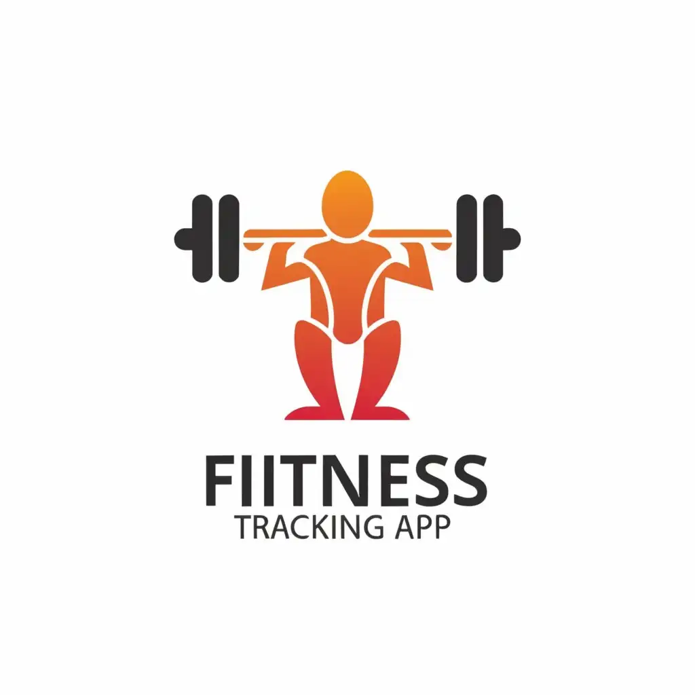
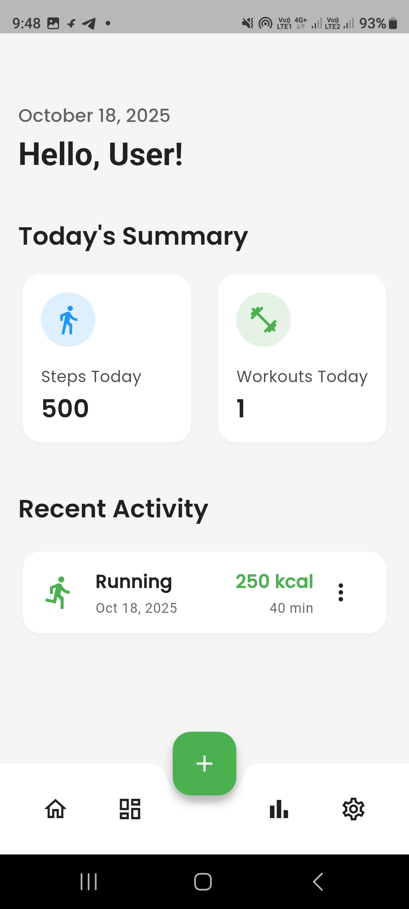
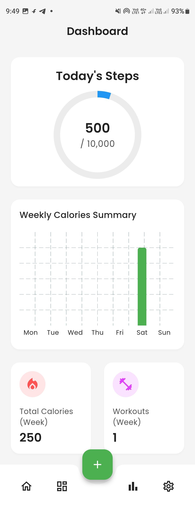
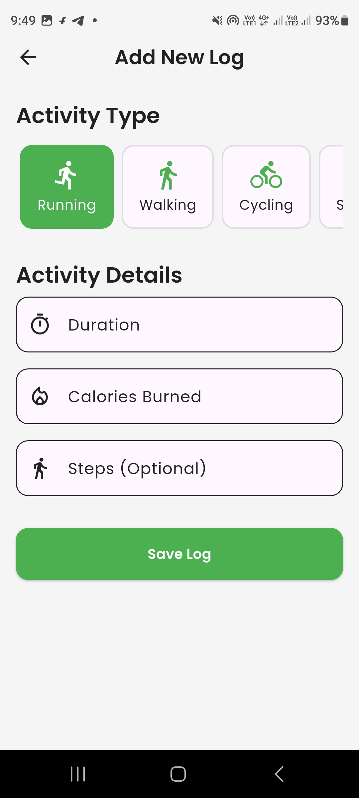
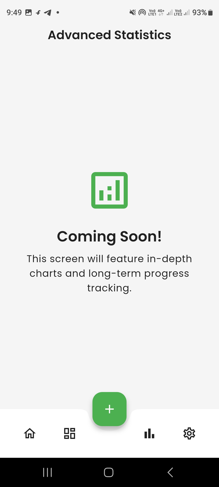
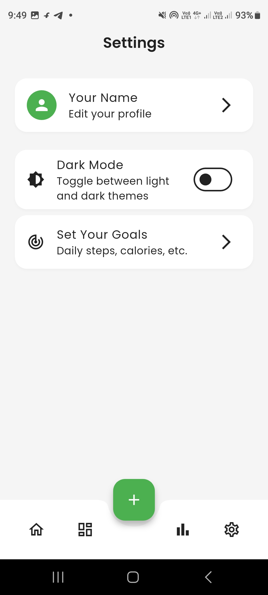

<div align="center">

# 🏋️‍♂️ **FitTrack**

### A Modern Flutter Fitness Tracker

**Your Personal Fitness Journey, Beautifully Crafted.**



<p>


</p>

</div>

> **Note**
> This project was developed as a task for the virtual internship program at **[CodeAlpha](https://codealpha.tech/)**.

---

## ✨ App Showcase

Experience the fluid UI, smooth animations, and seamless light/dark theme transitions.


---

## 🚀 Core Features

| Feature | Description | Status |
|---|---|---|
| 📊 **Modern Dashboard** | At-a-glance view of daily steps, weekly calories, and progress towards goals with animated charts. | ✅ Complete |
| ✍️ **Effortless Logging** | Manually add or edit activities with a refined, icon-based UI that's fast and intuitive. | ✅ Complete |
| 💾 **Dual Database** | Seamlessly switch between local SQLite for offline use, or Firebase for cloud backup. | ✅ Complete |
| ✨ **Polished UI/UX** | Built with Material 3, custom widgets, and a health-focused color palette for a stunning look. | ✅ Complete |
| ⚡ **Optimized Performance** | Architected for 120Hz displays, with efficient state management using Provider. | ✅ Complete |
| 🌓 **Light & Dark Theme** | Beautifully crafted light and dark modes that persist across app sessions. | ✅ Complete |

---

## ⚙️ Tech Highlights

- 🔄 Dual-database architecture (SQLite + Firebase)
- 🎨 Material 3 theming with custom components
- 📈 Animated charts and real-time stats
- 🧠 Provider-based state management
- 🌗 Persistent light/dark theme toggle
- 🪶 Smooth animations & 120Hz-ready UI
- 💡 Shared Preferences for theme persistence

---

## 🏛️ Architectural Philosophy

FitTrack is built with **clean architecture** principles, focusing on **Separation of Concerns** and **scalability**.

### 🧩 Layers Overview

-   **UI Layer (`screens/`, `widgets/`)**
    -   Handles user interface and interactions.
    -   Does not directly depend on data sources.

-   **State Management (`providers/`)**
    -   Managed via the **Provider** package.
    -   Acts as a bridge between UI and backend services.

-   **Service Layer (`api/`)**
    -   Abstract layer defining a `DatabaseService` interface.
    -   Enables switching between SQLite and Firestore without changing app logic.

-   **Data Layer (`api/sqlite_service.dart`, `api/firestore_service.dart`)**
    -   Implements actual database operations and synchronization.

This structure makes FitTrack **modular**, **testable**, and **easy to extend**.

---

## 🛠️ Tech Stack & Dependencies

| Category | Tool / Package |
|---|---|
| Framework | **Flutter** |
| State Management | **Provider** |
| Local Database | **SQFlite** |
| Cloud Database | **Cloud Firestore** |
| Charts | **fl_chart** |
| Typography | **Google Fonts (Poppins)** |
| Theme Persistence | **Shared Preferences** |

---

## 📂 Project Structure

```

lib/
├── api/                  \# Database services and abstraction layer
│   ├── database\_service.dart     \# Abstract service definition
│   ├── firestore\_service.dart    \# Cloud Firestore implementation
│   └── sqlite\_service.dart       \# Local SQLite implementation
│
├── models/               \# Data models used across the app
│   └── activity.dart           \# Activity data model
│
├── providers/            \# State management using Provider
│   ├── fitness\_provider.dart     \# Handles fitness data and logic
│   └── theme\_provider.dart       \# Manages app theme state
│
├── screens/              \# Main UI screens of the app
│   ├── add\_log\_screen.dart       \# Screen for adding/editing activities
│   ├── dashboard\_screen.dart     \# Displays stats and graphs
│   ├── home\_screen.dart          \# Main user navigation
│   ├── main\_screen.dart          \# Root app structure
│   └── settings\_screen.dart      \# Optional settings or profile screen
│
├── utils/                \# Helpers, constants, and theming
│   ├── app\_theme.dart            \# Light/Dark theme definitions
│   └── helpers.dart              \# Utility functions and constants
│
├── widgets/              \# Reusable UI components
│   ├── activity\_card.dart      \# Custom card showing an activity
│   ├── stat\_card.dart          \# Statistic display widget
│   └── ...                   \# Other custom widgets
│
└── main.dart             \# App entry point and initial setup

````

---

## 🏁 Getting Started

Follow these steps to get the project running locally on your system.

### 🔧 Prerequisites

-   Flutter SDK 3.x+
-   IDE: VS Code or Android Studio
-   Android Emulator or physical device


#### **1. Installation**

```bash
# Clone this repository
git clone https://github.com/1SoulHunter1/CodeAlpha_Fitness_Tracker_App.git

# Navigate into the project directory
cd CodeAlpha_Fitness_Tracker_App

# Install dependencies
flutter pub get
````

-----

## 2️⃣ Configure the Database

You can run the app with **SQLite (default)** or **Firebase Firestore** for cloud sync.

### 🗃️ SQLite (Default)

- No setup required.
- The app works offline out of the box.

### ☁️ Firebase Firestore (Optional)

1. Go to the [Firebase Console](https://console.firebase.google.com/).
2. Create a new Firebase project.
3. Add your Flutter app using the provided setup steps.
4. Run:
```bash
flutterfire configure
````

5. Enable Firestore Database in your Firebase console.
6. Modify the provider in lib/providers/fitness_provider.dart:
```bash
# Comment out the SQLite service
final DatabaseService _dbService = SqliteService();

# Uncomment the Firestore service
final DatabaseService _dbService = FirestoreService();
````

-----

### 3️⃣ Run the App

```bash
# Run in debug mode
flutter run
````

-----

### 4️⃣ Build the APK

```bash
# Build a release-ready APK
flutter build apk --release
````

📦 The APK will be generated at: **build/app/outputs/flutter-apk/app-release.apk**

-----

### 🖼️ Screenshots
<p align="center">      </p>

-----

### 🧱 Folder Summary

| Folder      | Purpose                                             |
| :---------- | :-------------------------------------------------- |
| `api/`      | Handles all data persistence and service abstraction. |
| `models/`   | Defines data structures like `Activity`.            |
| `providers/`| Manages app logic and state (fitness + theme).      |
| `screens/`  | Contains main app screens (Dashboard, Add Log, etc.). |
| `utils/`    | Contains theming and helper functions.              |
| `widgets/`  | Custom reusable UI components.                      |
| `main.dart` | Entry point for app initialization.                 |

-----

### 🧪 Performance Notes

  - Designed for high refresh rate displays (120Hz).
  - Optimized with Provider to reduce widget rebuilds.
  - Uses lazy loading for improved responsiveness.
  - Smooth animations powered by `fl_chart` and Material 3 motion.

-----

### 💡 Tips for Enhancement

  - 🧭 Add a user profile system with Firebase Auth.
  - 🌍 Integrate Google Fit or Apple Health APIs.
  - 📲 Add notifications for workout reminders.
  - 📊 Include more visual analytics for long-term progress.

-----

### 📄 License

This project is licensed under the MIT License — see the `LICENSE` file for details.

-----

### 🙌 Contributing

Contributions are always welcome!

Feel free to fork this repository, create a new branch, and submit a pull request.

<p align="center"\>
Made with ❤️ using Flutter
<br><br>
⭐ If you like this project, please consider giving it a star!
</p>

-----
